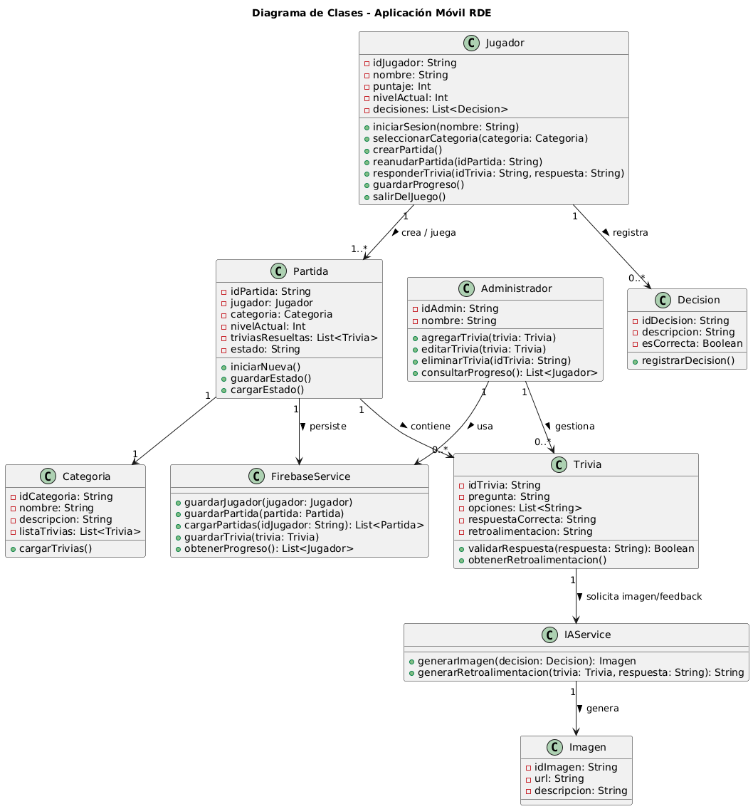
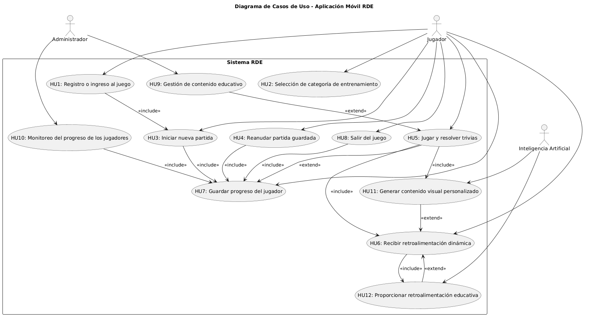

# 📱 Proyecto **RDE** — Aplicación Educativa en Simulación 3D

## 🎓 Universidad Antonio Nariño
**Facultad de Ingeniería de Sistemas y Computación**  
**Materia:** Ingeniería de Software  
**Docente:** *(Nombre del profesor)*  
**Autores:**
- Alisson Bonilla
- Natalia
- Brayanne Roberto Moreno Ruiz

**Bogotá D.C. — 2025**

---

## 📘 ¿Qué es y cómo utilizar *AppMovi (Proyecto Ingeniería)*

Este documento describe el desarrollo y funcionamiento del proyecto **RDE**, una aplicación móvil educativa en forma de videojuego 3D, creada con el propósito de enseñar a los niños cómo actuar correctamente frente a un terremoto.

---

## 📑 Tabla de Contenido

1. [Introducción](#introducción)
2. [Descripción general del proyecto](#descripción-general-del-proyecto)
3. [Objetivos del proyecto](#objetivos-del-proyecto)
    - [Objetivo general](#objetivo-general)
    - [Objetivos específicos](#objetivos-específicos)
4. [Análisis y requisitos](#análisis-y-requisitos)
    - [Requerimientos funcionales](#requerimientos-funcionales)
    - [Requerimientos de interfaz](#requerimientos-de-interfaz)
    - [Requisitos de rendimiento](#requisitos-de-rendimiento)
    - [Requisitos no funcionales](#requisitos-no-funcionales)
5. [Historias de usuario y criterios de aceptación](#historias-de-usuario-y-criterios-de-aceptación)
6. [Casos de uso del sistema](#casos-de-uso-del-sistema)
7. [Arquitectura de software](#arquitectura-de-software)
8. [Modelado estructural](#modelado-estructural)
9. [Modelado de comportamiento](#modelado-de-comportamiento)
10. [Diagramas de arquitectura](#diagramas-de-arquitectura)
11. [Escenarios operativos](#escenarios-operativos)
12. [Cronograma o calendario actualizado](#cronograma-o-calendario-actualizado)
13. [Conclusiones](#conclusiones)
14. [Bibliografía](#bibliografía)

---

## 🧩 Introducción

El proyecto **RDE** busca combinar educación y entretenimiento mediante un videojuego 3D que enseña a los niños cómo actuar adecuadamente durante un terremoto.  
Desarrollado en **Kotlin (sin Jetpack Compose)**, integra servicios de **inteligencia artificial** y **Firebase** para ofrecer una experiencia interactiva, persistente y educativa.

---

## 🧠 Descripción general del proyecto

**RDE** es una aplicación móvil educativa e interactiva desarrollada en **Kotlin**, que simula situaciones reales de emergencia.  
Los jugadores participan en una historia que evoluciona según sus decisiones y respuestas en trivias educativas.  
La integración de **IA** permite generar escenarios e imágenes dinámicas, personalizando la experiencia de aprendizaje.

---

## 🎯 Objetivos del Proyecto

### Objetivo General
Desarrollar una aplicación móvil interactiva que integre inteligencia artificial para enseñar a los niños cómo actuar ante un terremoto, mediante un entorno educativo 3D.

### Objetivos Específicos
- Implementar un sistema de registro e inicio de sesión básico.
- Diseñar una interfaz 3D interactiva adaptada al público infantil.
- Integrar trivias que refuercen el aprendizaje del usuario.
- Usar IA para generar imágenes o escenarios educativos personalizados.
- Garantizar persistencia de datos en Firebase.
- Permitir la expansión futura hacia otros desastres naturales (incendios, inundaciones, etc.).

---

## ⚙️ Análisis y Requisitos

### 5.1 Requerimientos Funcionales
1. El sistema debe permitir al usuario iniciar sesión con su nombre o alias.
2. El usuario podrá seleccionar una categoría de entrenamiento (“Modo Terremoto”).
3. El sistema debe crear, cargar y reanudar partidas guardadas.
4. La aplicación presentará trivias educativas durante el juego.
5. La IA generará imágenes o escenarios según las respuestas del jugador.
6. El sistema guardará progreso y mostrará historial de partidas.
7. El usuario podrá salir o reanudar el juego en cualquier momento.

### 5.2 Requerimientos de Interfaz
- Interfaz intuitiva, colorida y adecuada para niños.
- Botones grandes y elementos visuales claros.
- Pantallas principales: inicio, menú, escena 3D, trivias, resultados.
- Coherencia visual con el tema “terremoto”.
- Integración visual con las imágenes generadas por IA.

### 5.3 Requisitos de Rendimiento
- Carga inicial menor a **3 segundos**.
- Frecuencia mínima de **25 FPS**.
- Peticiones a IA y Firebase en menos de **2 segundos**.
- Uso de memoria ≤ 70 % del dispositivo.

### 5.4 Requisitos No Funcionales

**Seguridad:**
- Autenticación segura con Firebase.
- Sin almacenamiento de información sensible en texto plano.
- Validación de entradas para prevenir ataques.

**Fiabilidad:**
- Guardado automático del progreso.
- Manejo de errores de conexión con mensajes claros.

**Mantenibilidad:**
- Código organizado bajo arquitectura **MVVM**.
- Nombres descriptivos y comentarios en el código.

**Portabilidad:**
- Compatible con **Android 8.0 (API 26)** o superior.

**Extensibilidad:**
- Posibilidad de agregar nuevas categorías de desastres sin alterar el núcleo del juego.

**Reutilización:**
- Módulos de usuario, IA y Firebase reutilizables en futuras versiones.

---

## 👥 Historias de Usuario y Criterios de Aceptación

### 🎮 Rol: Jugador
- **HU1** — Registro e ingreso al juego
- **HU2** — Selección de categoría
- **HU3** — Crear nueva partida
- **HU4** — Reanudar partida guardada
- **HU5** — Resolver trivias
- **HU6** — Recibir retroalimentación de IA
- **HU7** — Guardar progreso
- **HU8** — Salir del juego

### 🛠️ Rol: Administrador
- **HU9** — Gestión de contenido educativo
- **HU10** — Monitorear progreso de jugadores

### 🤖 Rol: Inteligencia Artificial
- **HU11** — Generar contenido visual personalizado
- **HU12** — Proporcionar retroalimentación educativa

---

## 🧱 Modelado Estructural

### Diagrama de Clases (UML)

### Otros Diagramas
- Diagrama de Componentes
- Diagrama de Despliegue (Android + Firebase)
- Diagrama de Paquetes (MVVM)

---

## 🔁 Modelado de Comportamiento

- Diagrama de Actividad
- Diagrama de Estado
- Diagrama de Secuencia

---

## 🧩 Arquitectura de Software

- Aplicación del principio **SOLID**.
- Patrón arquitectónico **MVVM**, con mención del patrón **Hexagonal** como alternativa avanzada.
- Uso de microservicios externos solo para integración de IA (Play.ht).
- Diagramas **C4** (Contexto, Contenedores, Componentes).

---

## 📆 Cronograma

| Fase | Actividad | Fecha estimada |
|------|------------|----------------|
| 1 | Análisis y Requisitos | Octubre 2025 |
| 2 | Modelado y Diseño | Octubre–Noviembre 2025 |
| 3 | Desarrollo e Integración | Noviembre 2025 |
| 4 | Pruebas y Documentación Final | Diciembre 2025 |

---

## 🧾 Conclusiones

El proyecto **RDE** representa una integración efectiva entre la educación y la tecnología, aplicando principios de ingeniería de software y herramientas modernas para crear una experiencia educativa interactiva y significativa para los niños.

---

## 📚 Bibliografía

- Pressman, R. S. *Ingeniería de Software: Un Enfoque Práctico.*
- Sommerville, I. *Software Engineering.*
- Documentación oficial de Firebase y Kotlin.

---

