# RDE — Aplicación móvil educativa sobre emergencias sísmicas
Proyecto Ingeniería de Sistemas — Universidad Antonio Nariño

## Autores
- Alisson Bonilla
- Natalia
- Brayanne Roberto Moreno Ruiz

---

## Tabla de Contenido
- [1. RDE](#1-rde)
- [2. Introducción](#2-introducción)
- [3. Descripción general del proyecto](#3-descripción-general-del-proyecto)
- [4. Objetivos del proyecto](#4-objetivos-del-proyecto)
    - [4.1 Objetivo General](#41-objetivo-general)
    - [4.2 Objetivos Específicos](#42-objetivos-específicos)
- [5. Análisis y requisitos](#5-análisis-y-requisitos)
    - [5.1 Requerimientos Funcionales](#51-requerimientos-funcionales)
    - [5.2 Requerimientos de Interfaz](#52-requerimientos-de-interfaz)
    - [5.3 Requisitos de Rendimiento](#53-requisitos-de-rendimiento)
    - [5.4 Requisitos No Funcionales](#54-requisitos-no-funcionales)
- [6. Historias de Usuario y Criterios de Aceptación](#6-historias-de-usuario-y-criterios-de-aceptación)
- [7. Casos de Uso del Sistema](#7-casos-de-uso-del-sistema)
- [8. Arquitectura de Software](#8-arquitectura-de-software)
- [9. Modelado Estructural](#9-modelado-estructural)
- [10. Modelado de Comportamiento](#10-modelado-de-comportamiento)
- [11. Diagramas de Arquitectura](#11-diagramas-de-arquitectura)
- [12. Escenarios Operativos](#12-escenarios-operativos)
- [13. Cronograma](#13-cronograma)
- [14. Conclusiones](#14-conclusiones)
- [15. Bibliografía](#15-bibliografía)

---

# 1. RDE
El propósito de este documento es definir y describir los requisitos del proyecto RDE, explicar la funcionalidad del sistema y sus limitaciones.  
Fecha límite de entrega del documento: **11/11/2025**.

---

# 2. Introducción
RDE es una aplicación móvil educativa desarrollada en **Kotlin**, sin uso de Jetpack Compose, cuyo objetivo principal es enseñar a niños cómo actuar correctamente frente a un terremoto.  
La app integra servicios de **inteligencia artificial** y consumo de **API Service**, ofreciendo una experiencia interactiva y dinámica.

Este documento detalla los objetivos, requisitos, arquitectura, modelado y aspectos técnicos que definen la estructura del sistema.

---

# 3. Descripción general del proyecto
RDE es una app educativa donde los niños participan en una historia interactiva que evoluciona según sus decisiones y respuestas a trivias.  
La IA genera contenido visual dinámico para hacer la experiencia más inmersiva.

El sistema incluye:
- Registro e inicio de sesión
- Trivias
- Generación de escenas por IA
- Guardado y recuperación de partidas

---

# 4. Objetivos del proyecto

## 4.1 Objetivo General
Desarrollar una aplicación móvil educativa con integración de IA que enseñe a los niños cómo actuar ante un terremoto mediante un entorno interactivo y dinámico.

## 4.2 Objetivos Específicos
A. Implementar un sistema básico de registro e inicio de sesión.  
B. Diseñar una interfaz interactiva orientada al público infantil.  
C. Integrar trivias para evaluar el aprendizaje.  
D. Incorporar IA para generar imágenes o escenarios personalizados.  
E. Permitir guardar y reanudar partidas.  
F. Facilitar navegación por categorías de entrenamiento.

---

# 5. Análisis y requisitos

## 5.1 Requerimientos Funcionales
1. Ingreso del nombre e inicio de sesión.
2. Crear, cargar y reanudar partidas.
3. Presentación de trivias educativas.
4. Generación de imágenes por IA.
5. Guardado de progreso del jugador.
6. Reanudar o salir del juego en cualquier momento.

## 5.2 Requerimientos de Interfaz
1. Interfaz intuitiva, colorida y para niños.
2. Elementos grandes y visibles.
3. Pantallas principales:
    - Inicio
    - Trivias
    - Puntaje
4. Integración con imágenes generadas por IA.

## 5.3 Requisitos de Rendimiento
- Peticiones a IA y API < 2s.
- Uso de RAM < 70 %.

## 5.4 Requisitos No Funcionales

### Seguridad
- No almacenar datos sensibles en texto plano.
- Validaciones contra inyección de datos.

### Fiabilidad
- Guardado automático en eventos inesperados.
- Manejo de errores de conexión.

### Mantenibilidad
- Arquitectura MVVM.
- Código claro y documentado.

### Portabilidad
- Android 8.0 (API 26) o superior.

### Extensibilidad
- Permitir agregar nuevos modos (incendios, inundaciones).

### Reutilización
- Módulos de usuarios, almacenamiento y IA reutilizables.

### Uso de recursos
- Peticiones IA limitadas a lo esencial.

---

# 6. Historias de Usuario y Criterios de Aceptación
Rol: Jugador
________________________________________
HU1 – Registro o ingreso al juego
Como jugador,
quiero ingresar al juego utilizando mi nombre o alias,
para que el sistema guarde mi progreso y personalice mi experiencia.
Criterios de aceptación:
•	El jugador debe poder ingresar un nombre o alias antes de iniciar el juego.
•	El sistema debe validar que el campo no esté vacío.
•	Al confirmar, se debe crear o cargar una partida vinculada al jugador.
•	El sistema debe mostrar un mensaje de bienvenida con el nombre del jugador.
•	Fin del criterio de aceptación.
________________________________________
HU2 – Selección de categoría de entrenamiento
Como jugador,
quiero seleccionar una categoría (por ejemplo, modo terremoto),
para iniciar una partida relacionada con ese escenario educativo.
Criterios de aceptación:
•	El sistema debe mostrar las categorías disponibles.
•	Al seleccionar “Modo Terremoto”, debe cargarse la historia y los retos asociados.
•	El sistema debe permitir agregar futuras categorías sin alterar el flujo actual.
•	Fin del criterio de aceptación.
________________________________________
HU3 – Iniciar nueva partida
Como jugador,
quiero crear una nueva partida,
para comenzar desde el inicio del juego y registrar mi progreso.
Criterios de aceptación:
•	El sistema debe mostrar un botón o menú para crear nueva partida.
•	Al crearla, se deben inicializar las variables de progreso del jugador.
•	El sistema debe confirmar la creación con un mensaje visual.
•	Fin del criterio de aceptación.
________________________________________
HU4 – Reanudar partida guardada
Como jugador,
quiero reanudar mi partida guardada,
para continuar el progreso desde el punto donde la dejé.
Criterios de aceptación:
•	El jugador debe poder consultar una lista de partidas guardadas.
•	El sistema debe cargar correctamente el estado de la partida (nivel, respuestas, etc.).
•	Si no hay partidas guardadas, debe mostrar un mensaje informativo.
•	Fin del criterio de aceptación.

________________________________________
HU5 – Jugar y resolver trivias
Como jugador,
quiero responder trivias o preguntas interactivas,
para aprender las acciones correctas en situaciones de emergencia.
Criterios de aceptación:
•	El sistema debe presentar preguntas con opciones de respuesta.
•	Al responder, debe mostrar retroalimentación inmediata (correcta/incorrecta).
•	Las respuestas correctas deben influir en la evolución de la historia.
•	Fin del criterio de aceptación.
________________________________________
HU7 – Guardar progreso del jugador
Como jugador,
quiero guardar mi progreso actual,
para poder continuar más adelante desde el mismo punto.
Criterios de aceptación:
•	El sistema debe guardar los datos en Firebase (nivel, puntaje, decisiones).
•	La operación de guardado debe confirmarse visualmente.
•	Debe existir persistencia incluso si la app se cierra inesperadamente.

________________________________________
HU8 – Salir del juego
Como jugador,
quiero salir del juego de forma segura,
para cerrar la aplicación sin perder mi información.
Criterios de aceptación:
•	Al seleccionar “Salir”, el sistema debe guardar automáticamente el progreso.
•	La app debe cerrar la sesión y volver a la pantalla inicial.
•	Fin del criterio de aceptación.
•
________________________________________

Rol: Inteligencia Artificial
________________________________________
HU9 – Generar contenido visual personalizado
Como sistema de inteligencia artificial,
quiero generar imágenes o escenas según las respuestas del jugador,
para adaptar la historia de manera visual e interactiva.
Criterios de aceptación:
•	El sistema debe recibir la decisión del jugador como entrada.
•	Debe producir un resultado visual coherente (imagen o escena).
•	El tiempo de generación no debe exceder los 3 segundos.
•	Fin del criterio de aceptación.
________________________________________
HU10 – Proporcionar retroalimentación educativa
Como sistema de inteligencia artificial,
quiero ofrecer mensajes de refuerzo y corrección,
para apoyar el aprendizaje del jugador de manera personalizada.
Criterios de aceptación:
•	El sistema debe analizar la respuesta del jugador.
•	Debe generar un mensaje o audio educativo.
•	Si la IA no responde, debe mostrarse una retroalimentación por defecto.
•	Fin del criterio de aceptación.

# 7. Casos de Uso del Sistema

## 7.1 Actores
- **Usuario (Niño)**: Juega, responde, toma decisiones.
- **Sistema RDE**: Procesa lógica del juego.
- **Servicio de IA**: Genera imágenes dinámicas.
- **Google Sheets / API externa**: Servicios externos opcionales.

## 7.2 Casos de Uso
Incluyen registro, inicio de sesión, iniciar partida, responder trivias, generación IA, guardado, reanudar partida.

---

# 8. Arquitectura de Software
El proyecto RDE sigue una arquitectura modular basado en MVVM

## 8.1 Principios SOLID aplicados
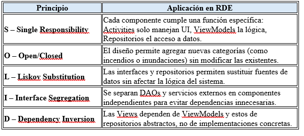

## 8.2 Patrón Arquitectónico: MVVM
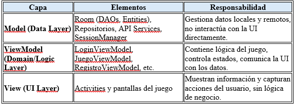

## 8.3 Microservicios utilizados
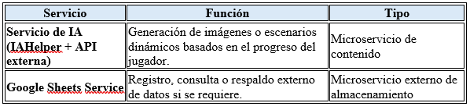

## 8.4 Diagramas C4
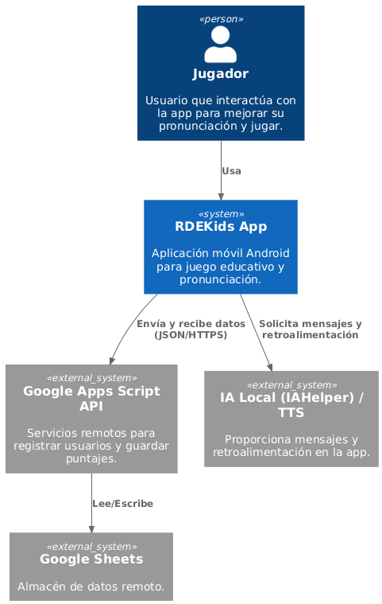
---
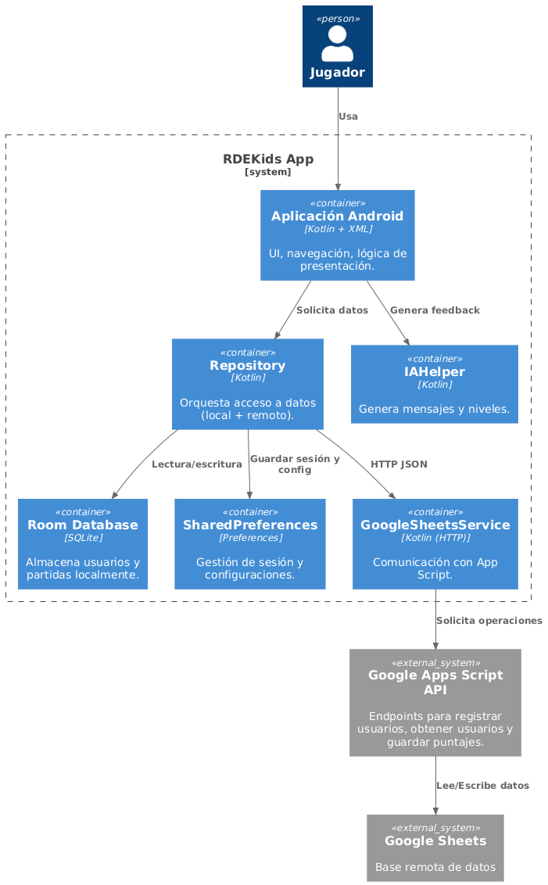
---
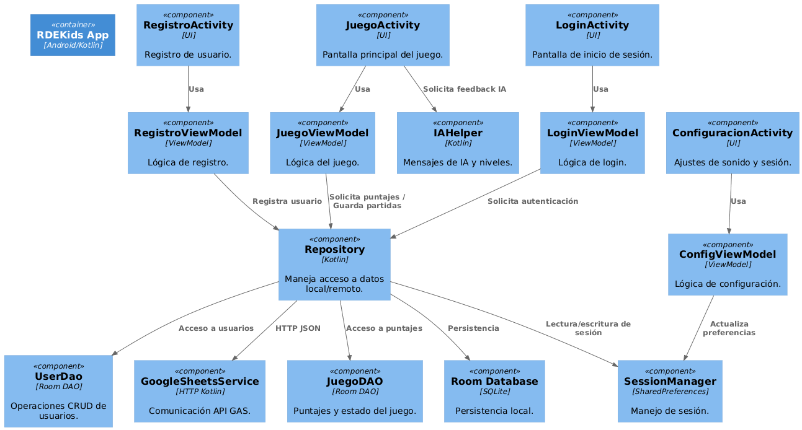

---

# 9. Modelado Estructural
Incluye diagramas de:
- Diagrama de Clases
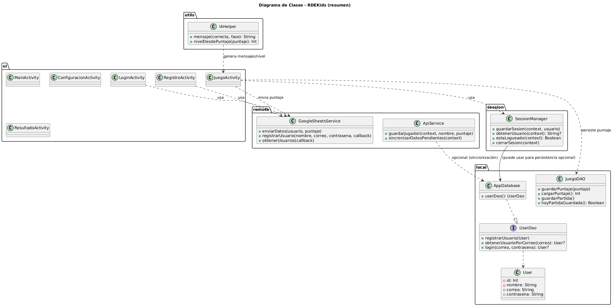
- Diagrama de Objetos
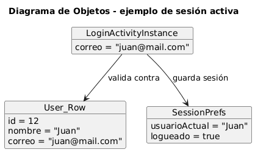
- Diagrama de Componentes
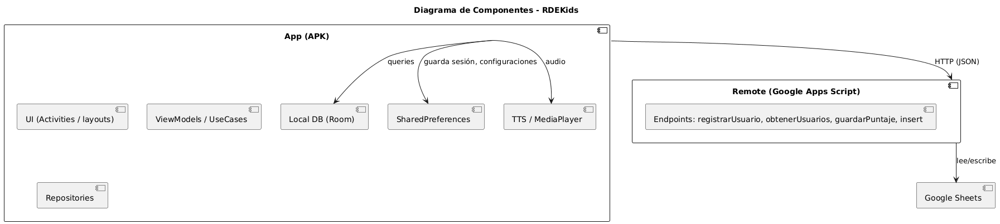
- Diagrama de Despliegue
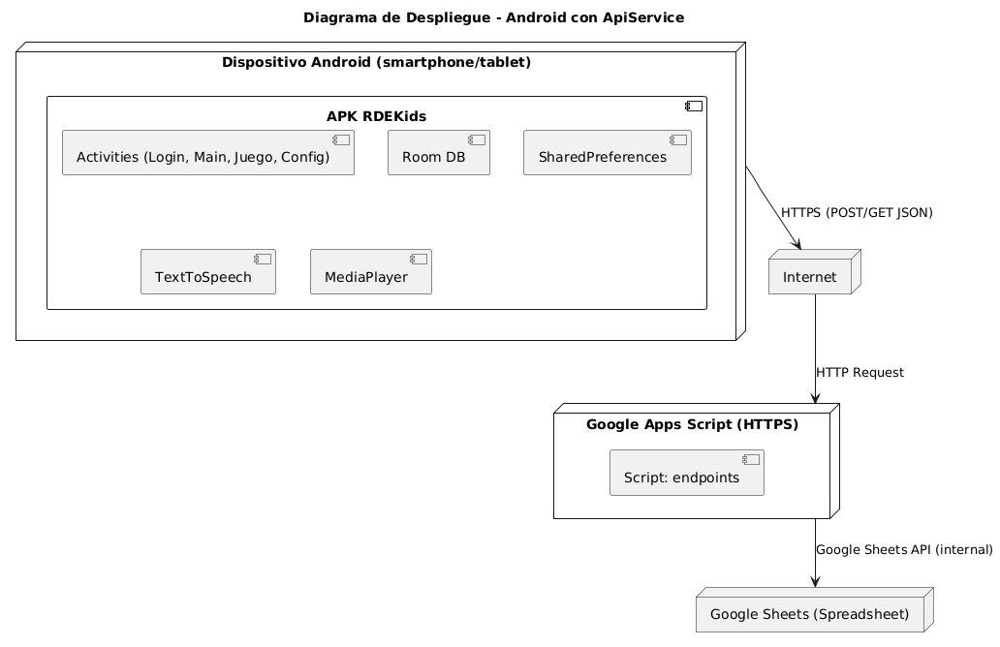
- Diagrama de Paquetes (MVVM)
- 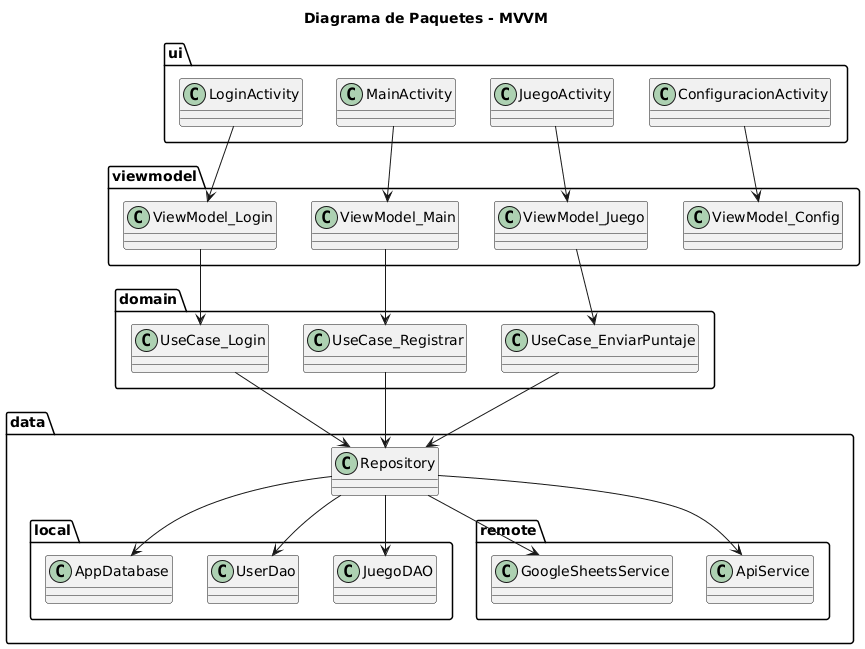

---

# 10. Modelado de Comportamiento
---
- 10.1 Diagrama de Casos De Uso
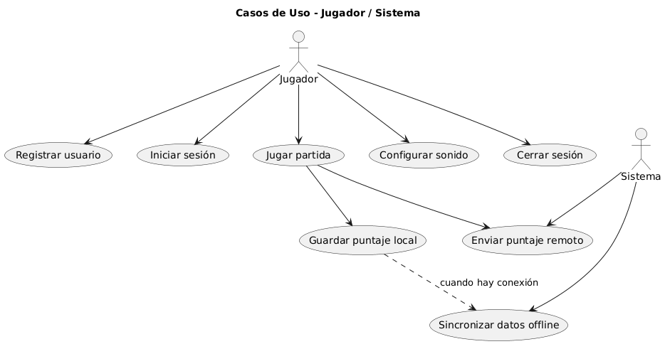
- 10.2 Diagrama de Actividad
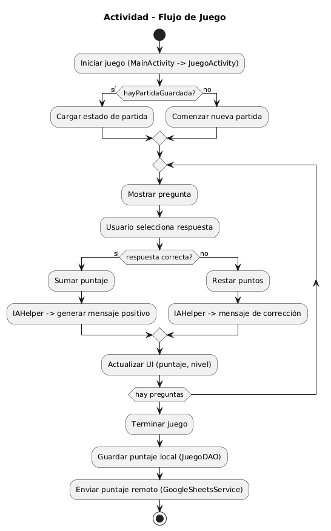
- 10.3 Diagrama de Estado
  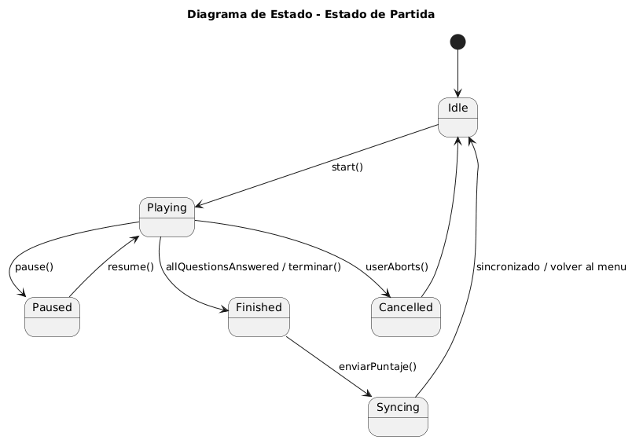
- 10.4 Diagrama de Secuencia
  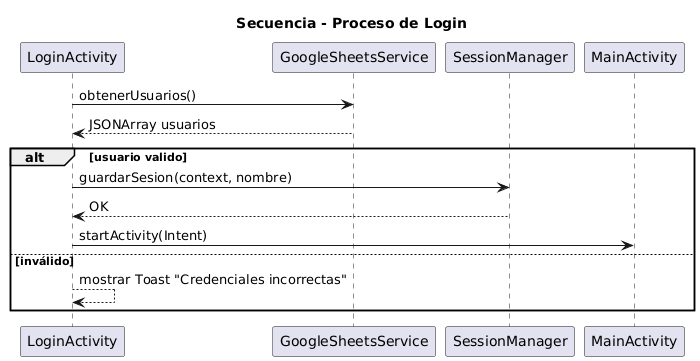
# 11. Diagramas de Arquitectura
- 11.1 Arquitectura de Software
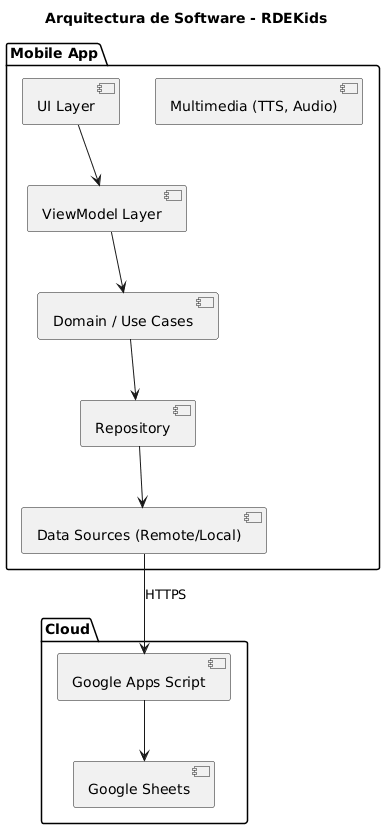
- 11.2 Arquitectura de Aplicaciones
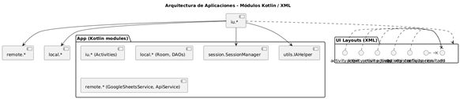
- 11.3 Arquitectura de Integración IA – API Service
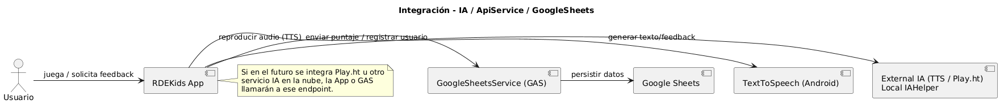
---

# 12. Escenarios Operativos
Descripción del flujo natural del usuario:
- Registro
- Selección de modo
- Juego interactivo
- IA generando contenido
- Guardado y reanudación

---

# 13. Cronograma
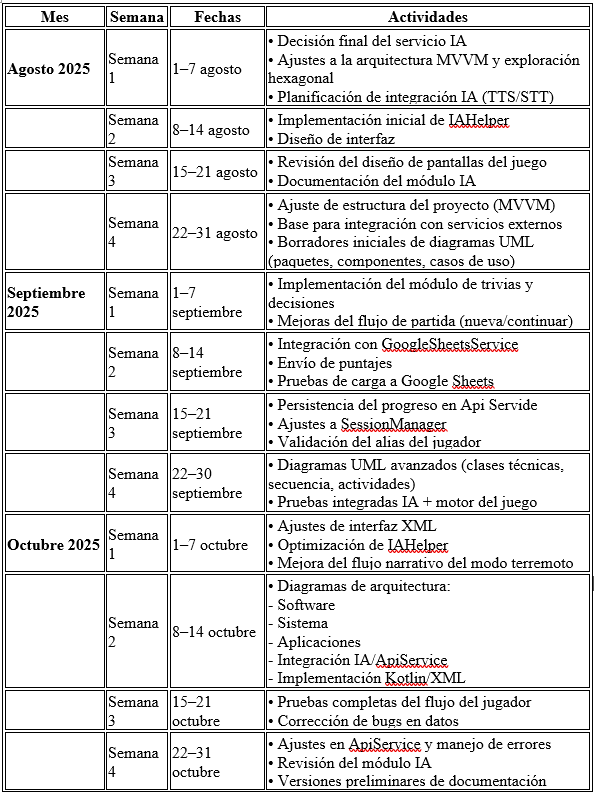

---

# 14. Conclusiones
RDE demuestra el potencial del aprendizaje interactivo mediante IA.  
La arquitectura MVVM garantiza escalabilidad y mantenibilidad.  
La IA mejora la inmersión educativa y personalización.

---

# 15. Bibliografía
- Android Developer Documentation
- Room Persistence Library Documentation  
